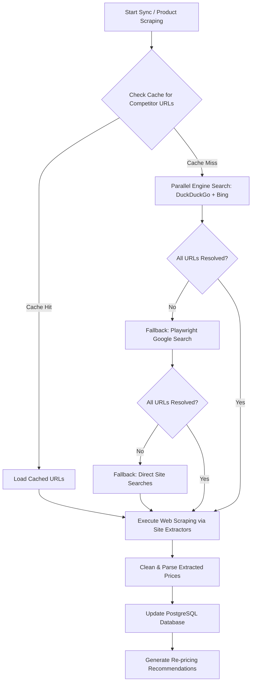

# PricePilot Project Technical Report

Welcome to the Technical Report for **PricePilot**. This document outlines every functional and architectural aspect of the system. It is structured to be clear and readable for a layman while providing deep technical specifications for engineering auditors.

---

## 1. Project Overview & Architecture

PricePilot is an automated pricing intelligence and catalog management dashboard. It tracks competitor prices in real-time, matches catalog products against external e-commerce sites, and runs a rule engine to calculate dynamic repricing recommendations.

### Key Capabilities
*   **Catalog Management**: Add, view, edit, and delete products, categories, margins, and cost prices.
*   **Competitor Tracking**: Scrape and monitor real-time prices across major online retailers: Amazon, Flipkart, Croma, Reliance Digital, and Vijay Sales.
*   **Rules Engine**: Establish custom pricing strategies (e.g., match minimum competitor, match maximum, maintain margin ceiling/floor).
*   **Theme Integration**: A state-of-the-art responsive dark/light mode UI with an animated toggle and customized light-blue accent theme.
*   **Supabase PostgreSQL Database**: Cloud-hosted relational database for transactional safety and persistence.

---

## 2. Scraping & Data Extraction Pipeline

The core intelligence of PricePilot relies on an automated, multi-tiered scraping pipeline powered by **Playwright (Chromium)** and server-side request dispatchers.

### Direct vs. Engine Search: Site Preferences
Different websites employ different search engine indexing and site search techniques:
1.  **Search Engines (Preferred First)**: We run parallel queries targeting DuckDuckGo (HTML endpoints) and Bing using a broadened product query restricted to specific domains (e.g. `site:amazon.in` or `site:croma.com`). This uses lightweight HTTP fetches, bypassing the need to launch resource-heavy browser windows.
2.  **Amazon & Flipkart**: These sites have highly volatile DOM elements and search structures. Broad search engine matches are preferred. When they fail, the system falls back to direct URL searches (`/s?k=` on Amazon, `/search?q=` on Flipkart).
3.  **Croma**: Croma's site-search handles broad keyword matches poorly on external engines sometimes, so if a search engine fails, the system executes a direct search by navigation (`/search/?text=`) directly on their site.
4.  **Reliance Digital**: Direct searches require simulating an active keyboard press in their search input bar. The scraper opens their homepage, targets the search input box, types the query, presses `Enter`, and scrapes the resulting cards.
5.  **Vijay Sales**: Vijay Sales uses simple URL parameters (`/search?q=`). Direct searches are fast and reliable.

---

## 3. Anti-Bot Bypassing & Cloaking

Modern e-commerce sites implement strict Web Application Firewalls (WAFs) like Cloudflare, Akamai, or PerimeterX to block automated scrapers. PricePilot utilizes advanced stealth techniques to bypass these measures:

*   **Automation Disabling Flags**: Chromium is launched with `--disable-blink-features=AutomationControlled` to strip out the standard window properties that signal webdriver usage.
*   **Dynamic Fingerprint Spoofing**: An init script is injected into every page context to override and mock navigator APIs:
    *   Sets `navigator.webdriver` to `undefined`.
    *   Spoofs `navigator.languages` to default US locales (`['en-US', 'en']`).
    *   Fills `navigator.plugins` with realistic mock arrays.
    *   Sets up standard browser runtime objects (`window.chrome = { runtime: {} }`).
*   **Resource Interception & Blocking**: To maximize speed and prevent trackers from triggering bot alerts, all heavy, non-essential resources are blocked. The scraper rejects:
    *   Images, fonts, and media.
    *   Common tracker scripts (Google Analytics, Segment, Hotjar, Facebook Pixel, etc.).
*   **Viewport & Headers Mocking**: Random, modern user-agents matching popular desktop Chrome configurations are selected alongside standard monitor resolutions (`1280x800`).
*   **Humanized Delays**: Random pauses (`waitForTimeout`) are introduced between pageloads and interactions to mimic human behavior rather than robotic, instantaneous actions.

---

## 4. Fallback Architecture

Web scraping is inherently fragile due to website layout updates and anti-bot bans. The fallback pipeline is structured to minimize complete failure:

1.  **Level 1: Cache Lookup**: The system searches `competitor_urls_cache.json` using a normalized broad query to avoid hitting external servers.
2.  **Level 2: DuckDuckGo HTML API**: Light HTTP requests without JavaScript are fired.
3.  **Level 3: Bing HTML Scraper**: Used if DuckDuckGo fails to yield results.
4.  **Level 4: Playwright Google fallback**: Opens an automated browser window to search Google for missing sites under site filters.
5.  **Level 5: Direct Site Search**: Connects directly to the competitor's search pages and simulates navigation.
6.  **Level 6: Price Extraction Selectors Fallback**: If an extractor fails to parse a page, it tries a list of alternative DOM query selectors. For example, on Amazon:
    *   Price selector options: `span.a-price-whole`, `span.apexPriceToPay`, `span.a-offscreen`.
    *   Availability selector options: `#outOfStock`, `div.a-color-price:has-text("Currently unavailable")`.

---

## 5. Text Matching & Product Validation

To prevent comparing apples to oranges, PricePilot utilizes a strict, weighted text-matching algorithm. A scraped competitor product candidate is validated through three major phases:

### Phase A: Token & Unit Normalization
*   Converts text to lowercase.
*   Replaces double quotes/apostrophes with standard units (e.g. `55"` $\rightarrow$ `55inch`).
*   Normalizes quantities and storage units (e.g., standardizes `milliliters` to `ml`, `liters` to `l`, and collapses spaces between numbers and units like `128 gb` $\rightarrow$ `128gb`).

### Phase B: Attribute Extraction & Hard Vetoes
The system parses key features. If any key attribute is present in both the main product and the scraped candidate, **they must match exactly, or the candidate is vetoed (rejected)**:
1.  **Storage / RAM**: A `128gb` phone will never match a `256gb` phone.
2.  **Weight**: A `1kg` pack will never match a `500g` pack.
3.  **Size / Screen Size**: A `55inch` TV will never match a `65inch` TV.
4.  **Quantity**: A pack of 2 items will never match a single item.
5.  **Apparel Size**: Medium size clothes will never match Large size clothes.
6.  **Resolution**: `4K` TVs will not match `1080p` TVs.
7.  **Power / Voltage**: `20W` chargers will not match `65W` chargers.
8.  **Category Vetoes**: TVs, ACs, Refrigerators, and Washing Machines are checked for synonym crossovers. For example, a TV wall mount (accessory) is vetoed if the search was for a TV itself.

### Phase C: Scoring & Similarity Optimization
If all vetos pass, a composite similarity score is calculated:
*   **Brand Match (Weight 30)**: Standardizes brands and synonyms (e.g. `Samsung` $\leftrightarrow$ `Galaxy`, `Xiaomi` $\leftrightarrow$ `Mi` $\leftrightarrow$ `Redmi`).
*   **Model Name Match (Weight 40)**: Removes brands, specs, and generic adjectives, then computes token-overlap and Levenshtein distance.
*   **Attribute Matching (Weight 30)**: Distributed evenly across the specs identified (RAM, storage, weight, size, volume, resolution, shoesize).

The final match score must exceed **70%** for the candidate link to be approved. This ensures maximum matching precision automatically.

---

## 6. How the System is Optimised
*   **Parallel Execution**: Scrapes and searches run concurrently using `Promise.all`.
*   **Cache Utilization**: Prevents repetitive queries by storing verified URLs locally.
*   **Reduced Overhead**: Blocks images, fonts, styling sheets, and analytic tracking scripts during crawling, which reduces data consumption by up to **80%** and cuts page load times in half.
*   **Database Constraints**: Automatically cleans up entries that do not match schemas or categories to prevent memory bottlenecks.
